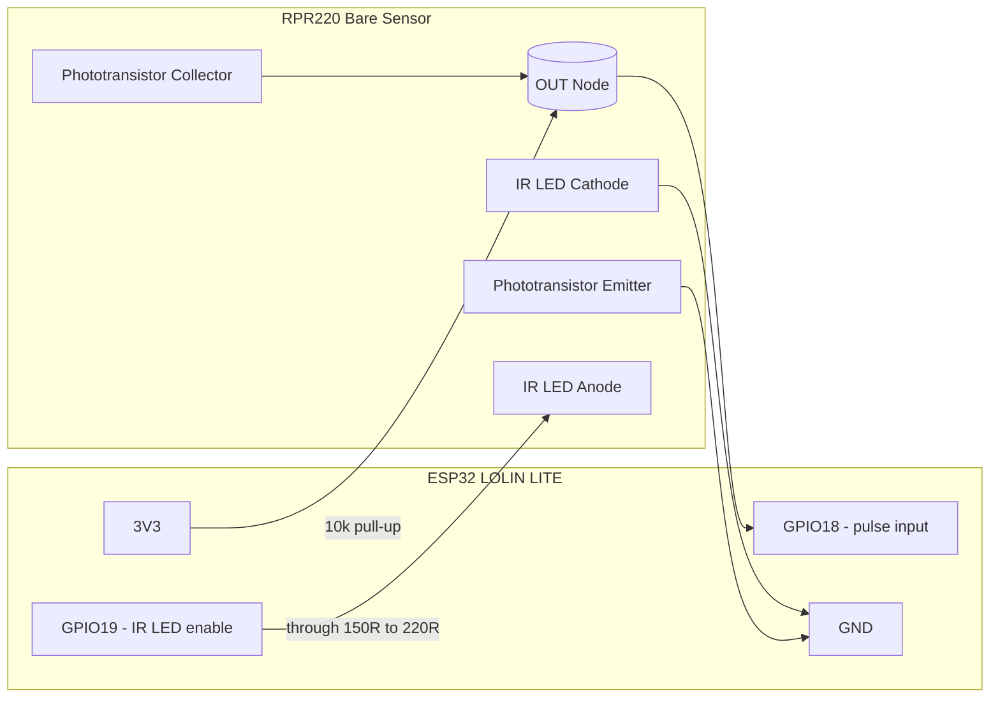

# Anemometer Wiring (RPR220 + ESP32 Lolin Lite)

## Assumptions
- Sensor: bare `RPR220` reflective optocoupler.
- Rotor pattern: `12 pulses/revolution` (12PPR).
- Signal input pin: `GPIO18`.
- IR LED enable pin: `GPIO19` (firmware defaults this pin ON at boot).
- ESP32 logic: `3.3V`.

## Wiring Diagram (Mermaid)

## Pin Summary
- `GPIO19` drives the IR LED current path.
  - `GPIO19 HIGH` means IR LED ON with current wiring.
- `GPIO18` reads pulses from the phototransistor output node.
- `OUT Node` is **not** tied directly to GND; only the phototransistor emitter goes to GND.

## Practical Notes
- If pulse polarity is inverted, switch ISR trigger in firmware (`FALLING` <-> `RISING`).
- If wiring is noisy, add `100nF` from `OUT` to `GND`.
- Conversion to m/s still requires calibration (`kMpsPerHz` in firmware).

## Optional Improvements
- For lower GPIO current or stronger drive margin, use a small transistor/MOSFET to switch the IR LED from `3V3`.
- The firmware can later sample with LED ON and OFF for ambient light rejection.
