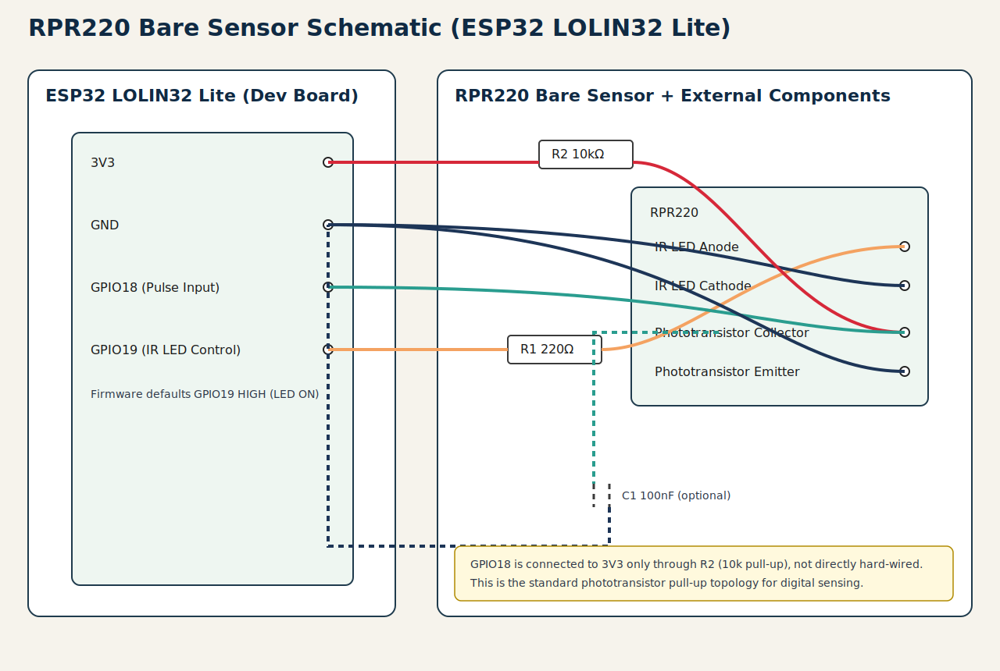

# Anemometer Wiring (RPR220 + ESP32 Lolin Lite)

## Assumptions
- Sensor: bare `RPR220` reflective optocoupler.
- Rotor pattern: `12 pulses/revolution` (12PPR).
- Signal input pin: `GPIO19`.
- IR LED control pin: `GPIO23` (firmware defaults this ON at boot).
- Virtual supply pins for sensor:
  - `GPIO18` driven `HIGH` (virtual VCC)
  - `GPIO5` driven `LOW` (virtual GND)

## Wiring Diagram (SVG)

## Pin Summary
- `GPIO23` drives the IR LED path through `R1`.
- `GPIO19` reads pulses from the phototransistor collector/sense line.
- `GPIO18` is used as the pull-up source via `R2`.
- `GPIO5` is used as the return path for sensor GND.

## Practical Notes
- If pulse polarity is inverted, switch ISR trigger in firmware (`FALLING` <-> `RISING`).
- If wiring is noisy, add `100nF` from the collector/GPIO19 sense line to `GPIO5`.
- Conversion to m/s still requires calibration (`kMpsPerHz` in firmware).
- RPR220 datasheet references test conditions around `IF=10mA`/`20mA`; `R1=220Ω` is a conservative starting value at this voltage.

## Optional Improvements
- For stronger drive margin and cleaner analog behavior, move virtual rails to physical `3V3/GND` or switch with a transistor/MOSFET.
- The firmware can later sample with LED ON and OFF for ambient light rejection.
